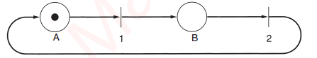
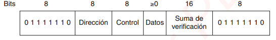

Jarod Cervantes Gutiérrez
2019243821
# Verificación de los protocolos
Protocolos en capa de enlace, tambien aplicables a otras capas.
## Modelos de máquinas de estado finito
Con la técnica de la máquina de estados finitos, cada elemento del protocolo siempre estará en un estado especifico.
El estado del sistema es la combincacipon de los estados de las dos máquinas de protocolos sy del canal
**Estado inicial** , descripción del sistema cuando comienza.
El análisis de asequibilidad permite determinar los estados alcanzables.
Estados finitos para protocolo, cuádruple (S, M, I, T)
Ausencia de bloqueos irreversibles
## Modelos de red de Petri
Cuatro elementos básicos: lugares, transiciones, arcos y tokens.
**lugar**, representa un estado del sistema
**token** punto grueso
**transición**, barra vertical

Comer, dormir, comer, dormir, ... determinista
Se reduce un protocolo complejo a reglas
# Ejemplos de protocolos de enlace de datos
## HDLC - Control de Enlace de Datos de Alto Nivel
Derivados del primer porotocolo de enlace de datos en los mainframes de IBM, SDLC (Control Síncrono de Enlace de Datos).
Orientados a bits.

Control, númeri de secuencia
Datos, cualquier informarción y longitud arbitraria
Suma de verificación, redunduancia cíclica
3 tipos de tramas: información, supervisión y no numeradas.
## La capa de ennlace de datos en Internet
Las lineas de punto a punto desempeñan un papel principal por la inmensa cantidad de personas que tienen conecciones domesticas.
Por cualquiera de las conexiones serequiere un protocolo para entramado, control de errores y demás funciones.
### PPP - Protocolo Punto a Punto
Se usa para tráfico da enrutados.
1. Método que delitmita el inicio y final de una trama.
2. control de enlace para activar lineas, probarlas, negociar y desactivar. LCP(Protocolo de control de enlace)
3. negociar opciones de capa de red